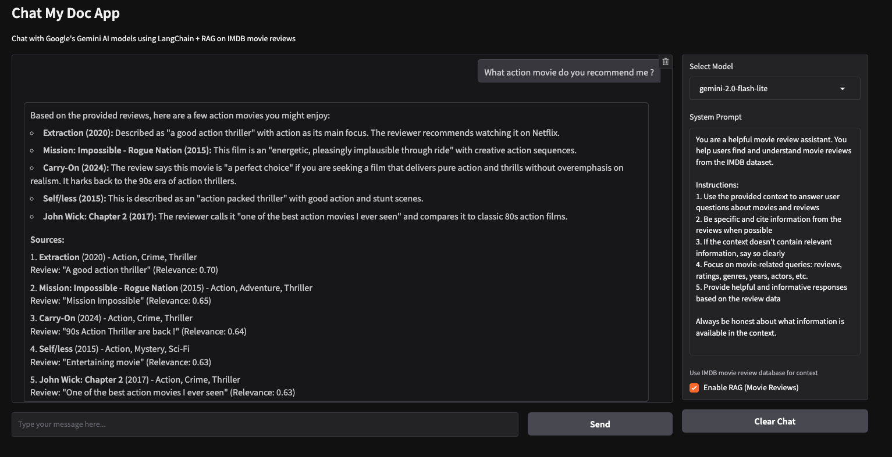

# Chat My Doc App

A modern Gradio-based chat application that leverages multiple AI models (Gemini and Mistral) through a unified gateway architecture. Chat with powerful AI models using a clean, intuitive web interface with conversation memory, streaming responses, and comprehensive RAG (Retrieval Augmented Generation) capabilities.

In this application you can chat with the LLM to get review insights on films which have been reviewed in IMDB web site. So you can get some recommendations or simply know what films are better than others regarding to their reviews. The app features dual chat modes: **Direct Chat** for general conversations and **RAG Chat** for movie-enhanced responses using a comprehensive IMDB reviews database.




## Features

### 🎯 Dual Chat Modes
- **Direct Chat**: Standard conversation with Gemini and Mistral models
- **RAG Chat**: Movie review-enhanced responses using comprehensive IMDB database
- **Smart Toggle**: Easy mode switching with maintained conversation memory

### 🤖 AI & Model Support
- **Multi-Model Support**: Unified access to Gemini (2.0 Flash, 1.5 Pro) and Mistral (7B-Instruct) models
- **Gateway Architecture**: Abstract base class supporting multiple LLM providers through unified API
- **Custom LangChain Integration**: Extensible chat models with streaming and async support
- **Real-Time Streaming**: Authentic LLM-native streaming responses (no artificial delays)

### 🔍 RAG Integration
- **LangGraph Workflows**: Structured 3-node processing (Retrieve → Generate → Respond)
- **Smart Context Integration**: Retrieves relevant movie reviews based on user queries
- **Rich Movie Metadata**: Formatted with title, year, genre, ratings
- **Source Citations**: Automatic citation generation with relevance scores
- **Qdrant Vector Database**: Efficient similarity search across IMDB reviews

### 💬 User Experience
- **Modern Chat Interface**: Clean Gradio-based web UI with real-time streaming responses
- **Conversation Memory**: Maintains context across conversations with session management
- **Custom System Prompts**: Personalize AI behavior for different use cases
- **Error Handling**: Graceful fallback when services unavailable

### 🛠️ Development & Deployment
- **Advanced CLI**: Full-featured command-line interface with Typer
- **Input Validation**: Robust parameter validation and error handling
- **Comprehensive Testing**: 80+ passing tests with unit and integration coverage
- **Cloud Ready**: Docker support with Google Cloud Run deployment
- **Development Tools**: Hot-reload, debug mode, and development utilities

## Quick Start

### Prerequisites

- Python 3.12+
- UV package manager (recommended) or pip
- Gateway API deployed (supports both Gemini and Mistral endpoints)
- Optional: Qdrant vector database for RAG functionality

### Installation

```bash
# Clone the repository
git clone <your-repo-url>
cd chat-my-doc-app

# Install dependencies with UV (recommended)
uv sync

# Or with pip
pip install -e .
```

### Environment Setup

Create a `.env` file in the project root:

```env
# Required: Your deployed gateway API URL
CLOUD_RUN_API_URL=https://your-gateway-api.run.app

# Optional: Custom port (defaults to 8000)
PORT=8000

# Optional: Qdrant configuration for RAG (if using RAG features)
QDRANT_URL=http://localhost:6333
QDRANT_API_KEY=your-qdrant-api-key
```

### Launch the Application

```bash
# Basic launch
uv run python src/chat_my_doc_app/main.py

# Development mode with debug and auto-open browser
uv run python src/chat_my_doc_app/main.py --debug --browser --port 7860

# Production mode
uv run python src/chat_my_doc_app/main.py --host 0.0.0.0 --port 8000
```

## Usage

### Command Line Interface

The application includes a full-featured CLI built with Typer:

```bash
# Show all available options
uv run python src/chat_my_doc_app/main.py --help

# Basic options
uv run python src/chat_my_doc_app/main.py [OPTIONS]

Options:
  --debug, -d              Enable debug mode with auto-reload
  --port, -p INTEGER       Port to run server on (1-65535)
  --host TEXT             Host to bind server to [default: 0.0.0.0]
  --share, -s             Create public shareable link
  --browser, -b           Auto-open in browser
  --help                  Show this message and exit
```

### Development Examples

```bash
# Development with hot-reload and browser auto-open
uv run python src/chat_my_doc_app/main.py -d -b -p 7860

# Share publicly (creates Gradio public link)
uv run python src/chat_my_doc_app/main.py --share

# Custom host and port
uv run python src/chat_my_doc_app/main.py --host localhost --port 3000

# Production deployment
uv run python src/chat_my_doc_app/main.py --host 0.0.0.0 --port 8080
```

### Web Interface

1. **Start the application** using one of the methods above
2. **Open your browser** to `http://localhost:8000` (or your custom port)
3. **Select an AI model** from the dropdown:
   - **Gemini Models**: `gemini-2.0-flash-lite`, `gemini-2.0-flash`, `gemini-1.5-pro`
   - **Mistral Models**: `mistral-7b-instruct`
4. **Choose chat mode**:
   - **Regular Chat**: Direct conversation with the selected model
   - **RAG Mode**: Enhanced responses using IMDB movie reviews database
5. **Start chatting** - your conversation history is maintained automatically
6. **Use the Clear button** to reset the conversation

### Using RAG Mode for Movie Insights

When RAG mode is enabled, ask movie-related questions to get enhanced responses:

**Example queries:**
- "What are some highly rated action movies?"
- "Tell me about romantic comedies from the 2000s"
- "Which movies have the best cinematography?"
- "What do critics say about Marvel movies?"

**Example RAG Response:**
```
Based on the movie reviews, here are some excellent sci-fi movies:

**The Matrix (1999)** stands out as a groundbreaking sci-fi film that
revolutionized action cinema with innovative effects and philosophical themes.
Reviews consistently praise its visual effects and storytelling.

**Blade Runner 2049 (2017)** is highly regarded for its stunning visuals
and thoughtful continuation of the original story...

**Sources:**
1. **The Matrix** (1999) - Action, Sci-Fi (Relevance: 0.95)
   Review: "Mind-blowing action movie" (Rating: 9/10)
2. **Blade Runner 2049** (2017) - Sci-Fi, Drama (Relevance: 0.89)
   Review: "Visual masterpiece" (Rating: 8/10)
```

## Architecture

### RAG System Architecture

```
┌─────────────────────────────────────────────────────────────────────┐
│                        GRADIO WEB INTERFACE                        │
└─────────────────────────┬───────────────────────────────────────────┘
                          │
                    [User Toggle]
                          │
            ┌─────────────┴─────────────┐
            │                           │
   ┌────────▼────────┐       ┌─────────▼─────────┐
   │  DIRECT CHAT    │       │    RAG CHAT       │
   │                 │       │                   │
   │ • LangGraph     │       │ • RAG Workflow    │
   │ • Gemini/Mistral│       │ • Movie Context   │
   │ • Memory        │       │ • Citations       │
   └─────────────────┘       └───────────┬───────┘
                                         │
                              ┌─────────▼─────────┐
                              │   RAG WORKFLOW    │
                              │                   │
                              │ ┌─────┐ ┌─────┐   │
                              │ │RETV │→│ GEN │   │
                              │ └──┬──┘ └──┬──┘   │
                              │    │       │      │
                              │ ┌──▼────┐  │      │
                              │ │RESPOND│◄─┘      │
                              │ └───────┘         │
                              └─────────┬─────────┘
                                        │
                           ┌────────────▼────────────┐
                           │     QDRANT VECTOR DB    │
                           │   (IMDB Movie Reviews)  │
                           └─────────────────────────┘
```

### Project Structure

```
chat-my-doc-app/
├── src/
│   └── chat_my_doc_app/
│       ├── app.py               # Gradio interface & Typer CLI
│       ├── chats.py             # Chat functionality & session management
│       ├── llms.py              # Gateway chat models (GeminiChat, MistralChat)
│       ├── rag.py               # RAG implementation with LangGraph workflows
│       ├── db.py                # Qdrant vector database integration
│       ├── config.py            # Configuration management
│       └── config/
│           └── config.yaml      # RAG & database configuration
├── tests/                       # Comprehensive test suite (80+ tests)
│   ├── unit/                    # Fast unit tests
│   │   ├── test_app.py         # CLI & interface tests
│   │   ├── test_llms.py        # LLM model tests
│   │   ├── test_rag.py         # RAG system tests
│   │   └── test_chats.py       # Chat functionality tests
│   └── integration/             # Integration tests
│       ├── test_app.py         # End-to-end app tests
│       └── test_rag.py         # RAG integration tests
├── .github/workflows/           # CI/CD pipelines
├── Dockerfile                   # Container configuration
├── pyproject.toml              # Project configuration
└── README.md                   # This comprehensive documentation
```

### Key Components

#### 1. **Gradio Interface** (`src/chat_my_doc_app/main.py`)
- Modern web UI with streaming chat
- Multi-model selection dropdown
- Session-based conversation memory
- Real-time response streaming

#### 2. **Gateway Chat Models** (`src/chat_my_doc_app/llms.py`)
- `GatewayChat` abstract base class extending `BaseChatModel`
- `GeminiChat` and `MistralChat` implementations
- Unified API interface for multiple LLM providers
- Streaming and async support with full LangChain compatibility

#### 3. **Chat Management** (`src/chat_my_doc_app/chats.py`)
- Conversation history management with LangGraph
- Multi-session support
- Model-agnostic chat routing (Gemini/Mistral)
- Streaming response handling and error handling

#### 4. **RAG System** (`src/chat_my_doc_app/rag.py`)
- LangGraph workflow implementation
- IMDB movie reviews retrieval system
- Model-agnostic design (works with any GatewayChat implementation)
- Document formatting and citation generation

#### 5. **CLI Application** (`src/chat_my_doc_app/app.py`)
- Built with Typer for professional CLI experience
- Input validation and helpful error messages
- Development and production modes
- Environment variable integration

## Configuration

### Environment Variables

| Variable | Description | Default | Required |
|----------|-------------|---------|----------|
| `CLOUD_RUN_API_URL` | Your deployed gateway API endpoint | None | ✅ Yes |
| `PORT` | Server port | 8000 | ❌ No |
| `QDRANT_URL` | Qdrant vector database URL | `http://localhost:6333` | ❌ No (for RAG) |
| `QDRANT_API_KEY` | Qdrant API key | None | ❌ No (for RAG) |

### RAG Configuration

The RAG system is configured via `src/chat_my_doc_app/config/config.yaml`:

```yaml
# Qdrant Database Configuration
qdrant:
  host: "34.87.227.185"  # Your Qdrant server host
  port: 6333
  collection_name: "imdb_reviews"
  search:
    default_limit: 5
    default_score_threshold: 0.0
    max_limit: 20

# RAG Processing Settings
rag:
  max_context_length: 4000
  context_overlap: 100
  retrieval:
    chunk_size: 300
    chunk_overlap: 50
    min_chunk_size: 50
  generation:
    include_sources: true
    source_format: "markdown"

# Embedding Model
embedding:
  model_name: "all-MiniLM-L6-v2"

# LLM Configuration
llm:
  api_url: "https://your-gemini-api-url"
  model_name: "gemini-2.0-flash-lite"
```

### Model Configuration

Available models (configured in `chats.py`):

**Gemini Models** (via `/gemini` and `/gemini-stream` endpoints):
- `gemini-2.0-flash-lite` (default)
- `gemini-2.0-flash`
- `gemini-1.5-pro`

**Mistral Models** (via `/mistral` and `/mistral-stream` endpoints):
- `mistral-7b-instruct`

### Gateway API Architecture

Your deployed gateway should expose these endpoints:
```
POST /gemini           # Gemini chat completion
POST /gemini-stream    # Gemini streaming chat
POST /mistral          # Mistral chat completion
POST /mistral-stream   # Mistral streaming chat
POST  /health          # Health check
```

## Performance Metrics

### RAG Processing Performance
- **Average Query Time**: ~500ms (including retrieval + generation)
- **Context Window**: Up to 4000 characters from retrieved reviews
- **Document Retrieval**: Top 5 most relevant reviews per query
- **Citation Generation**: Automatic with relevance scores (0.0-1.0)

### Streaming Performance
- **Real Streaming**: Uses authentic LLM-native streaming (no artificial delays)
- **Dynamic Chunking**: Natural response flow from language models
- **Memory Usage**: Efficient conversation storage with LangGraph state management
- **Concurrent Users**: Supports multiple simultaneous conversations

### Database Performance
- **Vector Search**: Millisecond-level similarity search in Qdrant
- **Collection Size**: 50,000+ IMDB movie reviews indexed
- **Embedding Model**: all-MiniLM-L6-v2 (384-dimensional vectors)
- **Search Accuracy**: Relevance-scored results with configurable thresholds

## Testing

The project includes comprehensive testing with 80+ passing tests across unit and integration suites:

```bash
# Run all tests
uv run pytest

# Run with coverage
uv run pytest --cov

# Run specific test categories
uv run pytest tests/unit/                          # Unit tests only
uv run pytest tests/integration/                   # Integration tests
uv run pytest tests/unit/test_llms.py             # LLM model tests
uv run pytest tests/unit/test_rag.py              # RAG system tests

# Run with verbose output
uv run pytest -v

# Run specific test
uv run pytest tests/unit/test_app.py::TestTyperCLI::test_cli_debug_mode -v

# Test RAG-specific functionality
uv run pytest tests/integration/test_rag.py -v
uv run pytest tests/integration/test_app.py -v
```

### Test Coverage

- ✅ **CLI Functionality**: All Typer CLI options and validation
- ✅ **Gradio Interface**: Component creation and functionality
- ✅ **LangChain Integration**: Custom GeminiChat and MistralChat model implementations
- ✅ **Chat Management**: Session handling and conversation memory
- ✅ **RAG System**: Complete RAG workflow testing (retrieve, generate, respond)
- ✅ **Vector Database**: Qdrant integration and document retrieval
- ✅ **Citation Generation**: Source formatting and relevance scoring
- ✅ **Streaming Responses**: Real-time response generation testing
- ✅ **Input Validation**: Port ranges, host formats, parameter validation
- ✅ **Error Handling**: Invalid inputs, service failures, and edge cases
- ✅ **Integration Testing**: End-to-end RAG pipeline with external services

### Troubleshooting Tests

**RAG Mode Issues:**
- ✅ Ensure Qdrant service is running on configured host
- ✅ Verify IMDB reviews collection exists in Qdrant
- ✅ Check network connectivity to Qdrant server
- ✅ Test with: `uv run pytest tests/integration/test_rag.py`

**Direct Chat Issues:**
- ✅ Set `CLOUD_RUN_API_URL` environment variable
- ✅ Verify Gemini/Mistral API endpoint accessibility
- ✅ Test with: `uv run pytest tests/integration/test_app.py`

## Deployment

### Gateway API Requirements

Before deploying the chat application, ensure your gateway API is running and accessible. The gateway should:

1. **Support Multiple Endpoints**:
   ```bash
   # Test your gateway endpoints
   curl -X POST https://your-gateway.run.app/gemini \
     -H "Content-Type: application/json" \
     -d '{"prompt": "Hello", "model_name": "gemini-2.0-flash-lite"}'

   curl -X POST https://your-gateway.run.app/mistral \
     -H "Content-Type: application/json" \
     -d '{"prompt": "Hello"}'
   ```

2. **Handle Streaming Responses**:
   ```bash
   # Test streaming endpoints
   curl -X POST https://your-gateway.run.app/gemini-stream \
     -H "Content-Type: application/json" \
     -d '{"prompt": "Tell me a story", "model_name": "gemini-2.0-flash-lite"}'
   ```

3. **Backend Services**: Ensure your Mistral service (e.g., on Compute Engine) is running and accessible from the gateway.

### Docker Deployment

```bash
# Build the container
docker build -t chat-my-doc-app .

# Run locally
docker run -p 8000:8000 \
  -e CLOUD_RUN_API_URL=your-api-url \
  chat-my-doc-app
```

### Google Cloud Run

The project includes automated deployment via GitHub Actions:

1. **Set up secrets** in your GitHub repository:
   - `GCP_PROJECT_ID`
   - `GCP_SA_KEY`
   - `CLOUD_RUN_API_URL`

2. **Push to main branch** - deployment happens automatically

3. **Manual deployment**:
```bash
# Deploy to Cloud Run
gcloud run deploy chat-my-doc-app \
  --source . \
  --platform managed \
  --region us-central1 \
  --set-env-vars CLOUD_RUN_API_URL=your-api-url
```

## Development

### Development Setup

```bash
# Install development dependencies
uv sync --group dev

# Install pre-commit hooks (recommended)
pre-commit install

# Run linting
uv run ruff check src/ tests/

# Run type checking
uv run mypy src/

# Run tests with coverage
uv run pytest --cov=src/chat_my_doc_app
```

### Development Commands

```bash
# Start in development mode
uv run python src/chat_my_doc_app/main.py --debug --browser

# Run with hot-reload on custom port
uv run python src/chat_my_doc_app/main.py -d -b -p 7860

# Create a public share link for testing
uv run python src/chat_my_doc_app/main.py --debug --share
```

### Adding New Features

1. **Models**: Add new model names to `get_available_models()` in `chats.py`
2. **New LLM Providers**: Create new classes inheriting from `GatewayChat` in `llms.py`
3. **CLI Options**: Extend the Typer command in `app.py`
4. **UI Components**: Modify the Gradio interface in `create_chat_interface()`
5. **RAG Sources**: Extend the RAG system for new document types
6. **Tests**: Add corresponding tests in the `tests/` directory

## API Reference

### Chat Functions

```python
from chat_my_doc_app.chats import chat_with_llm_astream, chat_with_rag_astream, get_available_models

# Stream chat responses with Gemini
async for chunk in chat_with_llm_astream(
    message="Hello, how are you?",
    model_name="gemini-2.0-flash-lite",
    session_id="user_123"
):
    print(chunk, end="")

# Stream chat responses with Mistral
async for chunk in chat_with_llm_astream(
    message="Hello, how are you?",
    model_name="mistral-7b-instruct",
    session_id="user_123"
):
    print(chunk, end="")

# RAG-enhanced responses (works with any model)
async for chunk in chat_with_rag_astream(
    message="Tell me about action movies",
    model_name="gemini-2.0-flash-lite",  # or "mistral-7b-instruct"
    session_id="user_123"
):
    print(chunk, end="")

# Get available models
models = get_available_models()  # Returns both Gemini and Mistral models
```

### Custom LangChain Models

```python
from chat_my_doc_app.llms import GeminiChat, MistralChat
from chat_my_doc_app.rag import RAGImdb

# Initialize Gemini model
gemini_llm = GeminiChat(
    model_name="gemini-2.0-flash-lite"
)

# Initialize Mistral model
mistral_llm = MistralChat()

# Use directly with LangChain
response = gemini_llm.invoke("What is the capital of France?")

# Use with RAG system (model-agnostic)
rag_system = RAGImdb(chat_model=gemini_llm)  # or mistral_llm
result = rag_system.process_query("Tell me about action movies")

# Stream responses
async for chunk in gemini_llm.astream(messages):
    print(chunk.content, end="")
```

## Contributing

1. **Fork the repository**
2. **Create a feature branch**: `git checkout -b feature/amazing-feature`
3. **Make your changes** and add tests
4. **Run tests**: `uv run pytest`
5. **Run linting**: `uv run ruff check src/ tests/`
6. **Commit your changes**: `git commit -m 'Add amazing feature'`
7. **Push to branch**: `git push origin feature/amazing-feature`
8. **Open a Pull Request**

## License

This project is licensed under the MIT License - see the [LICENSE](LICENSE) file for details.

## Acknowledgments

- **Gradio** - For the excellent web UI framework
- **LangChain** - For the flexible LLM integration framework
- **Typer** - For the modern CLI framework
- **Google** - For the powerful Gemini AI models
- **UV** - For fast and reliable Python package management

## Next Steps & Roadmap

The application is now ready for:

### 🚀 **Current Capabilities**
- ✅ Dual chat modes (Direct + RAG)
- ✅ Multi-model support (Gemini + Mistral)
- ✅ Real-time streaming responses
- ✅ IMDB movie review integration
- ✅ Production-ready deployment

### 🎯 **Future Enhancements**
- **Confidence Scoring**: Query routing based on confidence levels
- **Additional Data Sources**: Expand beyond IMDB reviews
- **Advanced Features**: Query history, user preferences, conversation export
- **Performance Optimization**: Caching, parallel processing
- **UI Improvements**: Custom themes, mobile responsiveness

## Support

- **Issues**: [GitHub Issues](https://github.com/your-username/chat-my-doc-app/issues)
- **Discussions**: [GitHub Discussions](https://github.com/your-username/chat-my-doc-app/discussions)
- **Documentation**: This README and inline code documentation

---

**Built with ❤️ using Python, Gradio, and LangChain**
